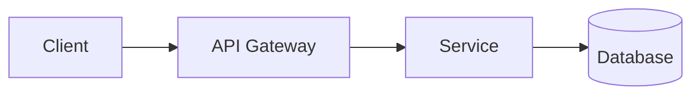

# 🏗️ アーキテクチャ設計

## プロジェクト構成
```
apps/
├── api/          # Go バックエンド
│   ├── cmd/      # エントリーポイント
│   └── internal/ # ドメイン別パッケージ
│       ├── auditzip/  # 監査ZIP生成
│       └── pint/      # JP PINTインボイス
└── web/          # Next.js フロントエンド
    └── src/
        ├── app/  # App Router
        └── lib/  # 共通ライブラリ

openapi/          # API契約（唯一の真実）
docs/architecture/  # 設計ドキュメント
```

## 設計原則

### 1. Contract-First
- OpenAPI → コード生成（逆は禁止）
- 参照: [openapi/*.yaml](../../../openapi/)

### 2. クリーンアーキテクチャ
```
Handler → Service → Repository
   ↓         ↓          ↓
 (HTTP)  (Business)  (Storage)
```

### 3. マルチテナント
- Row-Level Security（RLS）
- 全テーブルに `tenant_id`
- コンテキストからテナント取得

### 4. 監査ログ（電帳法）
- append-only（削除禁止）
- ハッシュチェーン（改ざん検知）
- 7年保持

## 出力形式

### 1. アーキテクチャ図（Mermaid）


### 2. コンポーネント責務
| コンポーネント | 責務 |
|--------------|------|
| Handler | HTTPリクエスト処理 |
| Service | ビジネスロジック |
| Repository | データアクセス |

### 3. データフロー
- 入力 → バリデーション → 処理 → 永続化 → レスポンス

### 4. エラーハンドリング方針

### 5. 実装優先度
| 優先度 | タスク | 理由 |
|-------|-------|------|
| P0 | ... | ... |

---

## 📝 設計依頼

**対象**: （設計する機能/コンポーネント）
**背景**: （なぜこの設計が必要か）
**要件**:
- 機能要件: 
- 非機能要件: （性能/可用性/セキュリティ）
**制約**: （既存システムとの互換性など）

---

上記に従って設計を提案してください。
